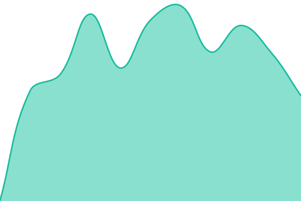
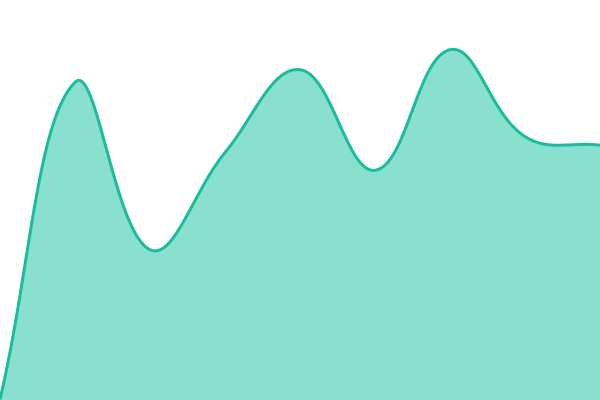
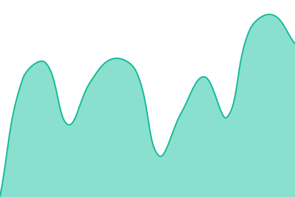
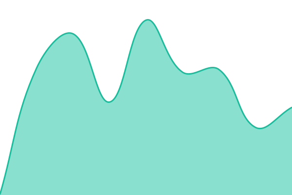

# [📈 Live Status](https://uptime.ajm.codes): <!--live status--> **🟩 All systems operational**

This repository contains the open-source uptime monitor and status page for [AJ Markow](https://ajm.codes), powered by [Upptime](https://github.com/upptime/upptime).

With [Upptime](https://upptime.js.org), you can get your own unlimited and free uptime monitor and status page, powered entirely by a GitHub repository. We use [Issues](https://github.com/ajmarkow/uptime/issues) as incident reports, [Actions](https://github.com/ajmarkow/uptime/actions) as uptime monitors, and [Pages](https://uptime.ajm.codes) for the status page.

<!--start: status pages-->
<!-- This summary is generated by Upptime (https://github.com/upptime/upptime) -->
<!-- Do not edit this manually, your changes will be overwritten -->
<!-- prettier-ignore -->
| URL | Status | History | Response Time | Uptime |
| --- | ------ | ------- | ------------- | ------ |
|  [AJM.CODES](https://ajm.codes) | 🟩 Up | [ajm-codes.yml](https://github.com/ajmarkow/uptime/commits/HEAD/history/ajm-codes.yml) | 

 226ms
     
 | 

<a href="https://uptime.ajm.codes/history/ajm-codes">100.00%</a>
    

|  [BESZEL.AJ-CLOUD.CC](https://beszel.aj-cloud.cc) | 🟩 Up | [beszel-aj-cloud-cc.yml](https://github.com/ajmarkow/uptime/commits/HEAD/history/beszel-aj-cloud-cc.yml) | 

 200ms
     
 | 

<a href="https://uptime.ajm.codes/history/beszel-aj-cloud-cc">98.49%</a>
    

|  [BIRDNET.AJ-CLOUD.CC](https://birdnet.aj-cloud.cc) | 🟩 Up | [birdnet-aj-cloud-cc.yml](https://github.com/ajmarkow/uptime/commits/HEAD/history/birdnet-aj-cloud-cc.yml) | 

 194ms
     
 | 

<a href="https://uptime.ajm.codes/history/birdnet-aj-cloud-cc">98.53%</a>
    

|  [KEEPER.AJ-CLOUD.CC](https://keeper.aj-cloud.cc) | 🟩 Up | [keeper-aj-cloud-cc.yml](https://github.com/ajmarkow/uptime/commits/HEAD/history/keeper-aj-cloud-cc.yml) | 

 444ms
     
 | 

<a href="https://uptime.ajm.codes/history/keeper-aj-cloud-cc">98.58%</a>
    

|  [L.AJM.CODES](https://l.ajm.codes/dashboard) | 🟩 Up | [l-ajm-codes.yml](https://github.com/ajmarkow/uptime/commits/HEAD/history/l-ajm-codes.yml) | 

 372ms
     
 | 

<a href="https://uptime.ajm.codes/history/l-ajm-codes">100.00%</a>
    

|  [N8N.AJ-CLOUD.CC](https://n8n.aj-cloud.cc) | 🟩 Up | [n8-n-aj-cloud-cc.yml](https://github.com/ajmarkow/uptime/commits/HEAD/history/n8-n-aj-cloud-cc.yml) | 

 244ms
     
 | 

<a href="https://uptime.ajm.codes/history/n8-n-aj-cloud-cc">98.63%</a>
    

|  [PASEO.AJ-CLOUD.CC](https://paseo.aj-cloud.cc/api/health) | 🟩 Up | [paseo-aj-cloud-cc.yml](https://github.com/ajmarkow/uptime/commits/HEAD/history/paseo-aj-cloud-cc.yml) | 

 181ms
     
 | 

<a href="https://uptime.ajm.codes/history/paseo-aj-cloud-cc">98.68%</a>
    

<!--end: status pages-->

[**Visit our status website →**](https://uptime.ajm.codes)

## 📄 License

- Powered by: [Upptime](https://github.com/upptime/upptime)
- Code: [MIT](./LICENSE) © [Anand Chowdhary](https://anandchowdhary.com), supported by [Pabio](https://pabio.com)
- Data in the `./history` directory: [Open Database License](https://opendatacommons.org/licenses/odbl/1-0/)
